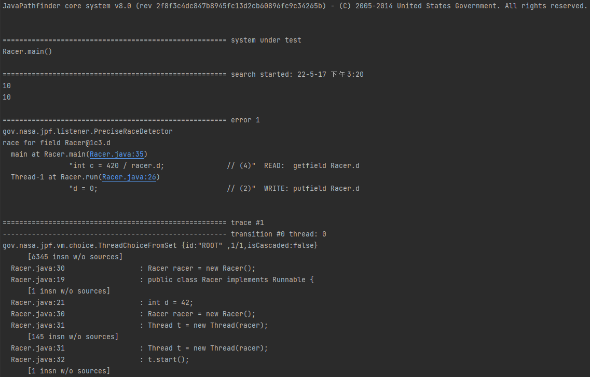
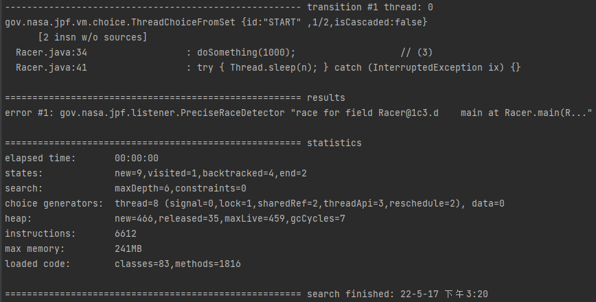

# Software-Security-Seminar

### This is the repository for COMP63342 Software Security Seminar by Zhaoyu Zhang.

# Understanding Programming Bugs in Java Programs Using Counterexamples - Optimizing minimal counterexamples

## Dependencies
Java PathFinder(JPF)

Java Bounded Model Checker(JBMC)

IDEA Intellij Community Edition

## How to install
JPF and JBMC are required to install on your machine prior to clone this repository, please go to their github page for more details.

## How to build
Once the repository is cloned, use Intellij or terminal to build under gradle environment:

  

    <h4>./gradlew build</h1>
  

and run all tests by

  

    <h4>./gradlew test</h1>
  

## How to run
Run the following command:

  

    <h4>java -jar [your RunJPF.jar path] [your example.jpf built]</h1>
  

An example of running can be shown as

  

    <h4>java -jar build/RunJPF.jar src/examples/Racer.jpf</h1>
  

For JBMC, simply add jbmc.exe into your PATH variable(under Windows machine) and use the command in a terminal

  

    <h4>jbmc [your java '.class' file path]</h1>
  

An example of running can be shown as (do not include .class suffix in argument)

  

    <h4>jbmc src/main/java/Testing/Main</h1>
  

## Example

An example of JPF output:

## Demostration
The detailed demonstration of this seminar can be seen inside the PDF or PPT attached.
